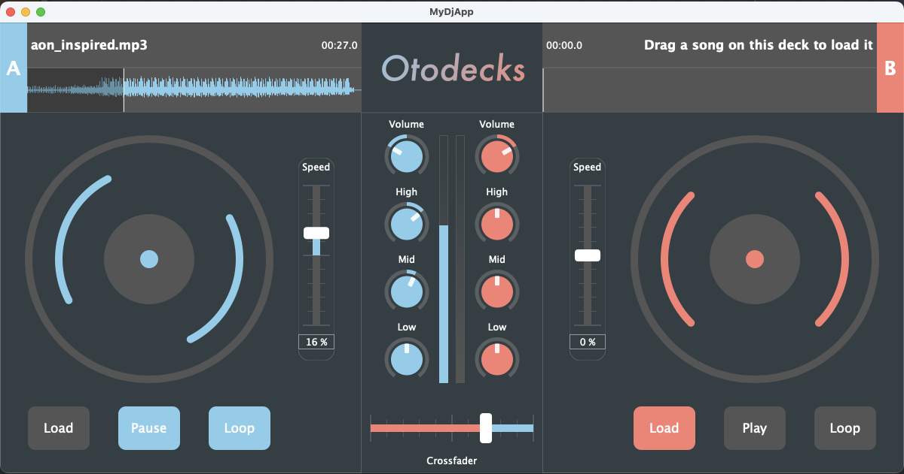
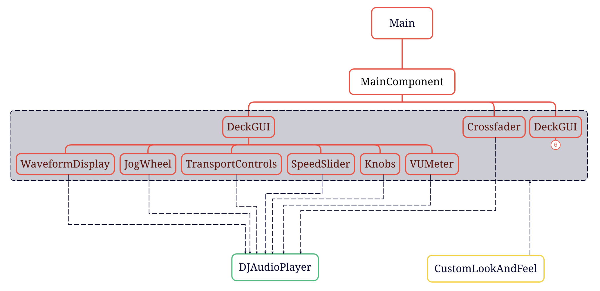
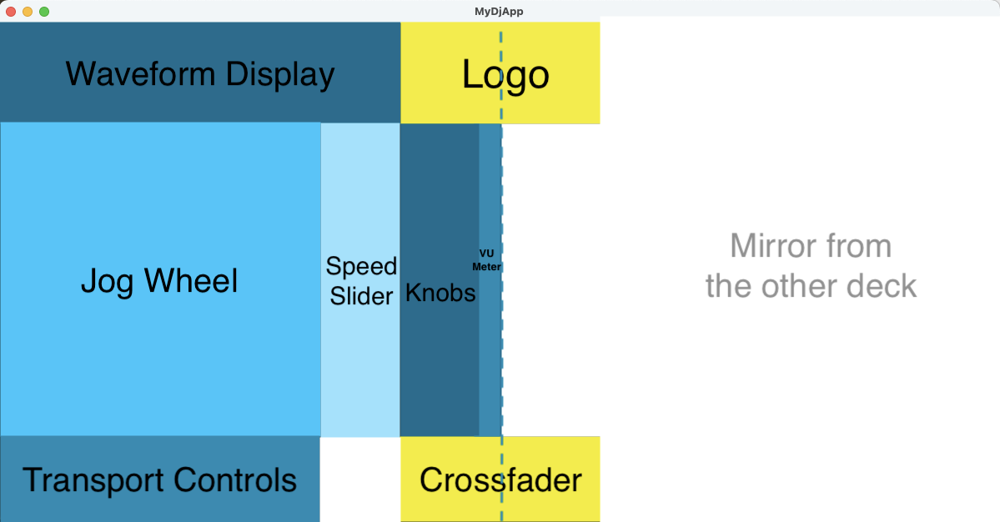
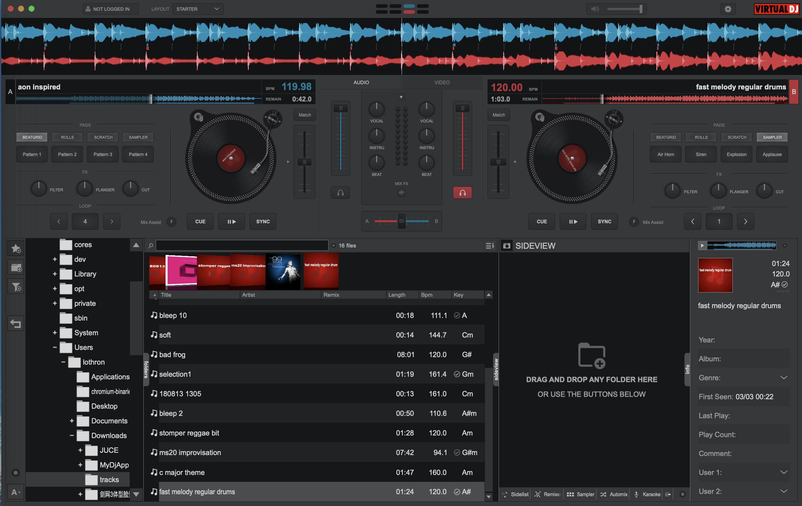
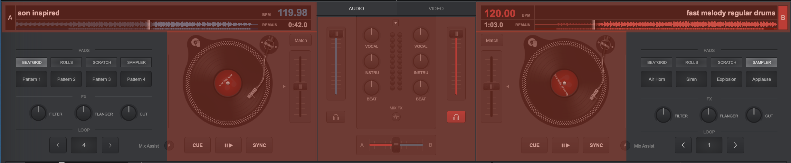

# OOP Final Project Report

Name: Yue Wu

Student ID: 210312838

- [OOP Final Project Report](#oop-final-project-report)
  - [Introduction](#introduction)
  - [Code structure and user interface layout](#code-structure-and-user-interface-layout)
  - [R1: Basic program functionality](#r1-basic-program-functionality)
    - [R1A: can load audio files into audio players (Load button \& Drag-and-drop)](#r1a-can-load-audio-files-into-audio-players-load-button--drag-and-drop)
    - [R1B: can play two or more tracks (Play/Pause button)](#r1b-can-play-two-or-more-tracks-playpause-button)
    - [R1C: can mix the tracks by varying each of their volumes (Volume slider)](#r1c-can-mix-the-tracks-by-varying-each-of-their-volumes-volume-slider)
    - [R1D: can speed up and slow down the tracks (Speed slider)](#r1d-can-speed-up-and-slow-down-the-tracks-speed-slider)
  - [R2 Customizing the user interface](#r2-customizing-the-user-interface)
    - [R2A: GUI layout is significantly different from the basic DeckGUI shown in class](#r2a-gui-layout-is-significantly-different-from-the-basic-deckgui-shown-in-class)
      - [1. Redesign the general layout](#1-redesign-the-general-layout)
      - [2. Refactor the code structure](#2-refactor-the-code-structure)
      - [3. Define a color scheme](#3-define-a-color-scheme)
      - [4. Create a custom look and feel class](#4-create-a-custom-look-and-feel-class)
      - [5. Overlap the position slider and the waveform display](#5-overlap-the-position-slider-and-the-waveform-display)
      - [6. Make buttons toggle-able and add color indication of the button state](#6-make-buttons-toggle-able-and-add-color-indication-of-the-button-state)
      - [7. Add new components to the GUI](#7-add-new-components-to-the-gui)
    - [R2B: GUI code has at least one event listener that was not in the original codebase seen in class.](#r2b-gui-code-has-at-least-one-event-listener-that-was-not-in-the-original-codebase-seen-in-class)
      - [1. User event listeners](#1-user-event-listeners)
      - [2. State change listeners](#2-state-change-listeners)
  - [R3](#r3)
    - [Research and analysis of a real DJ program](#research-and-analysis-of-a-real-dj-program)
    - [Design of the new features](#design-of-the-new-features)
    - [Implementation of the new features](#implementation-of-the-new-features)
      - [1. The 3-band equalizer](#1-the-3-band-equalizer)
      - [2. The VU meter](#2-the-vu-meter)
      - [3. The jog wheel](#3-the-jog-wheel)
      - [4. The crossfader](#4-the-crossfader)
      - [5. The waveform display upgrade](#5-the-waveform-display-upgrade)
      - [6. Logo](#6-logo)
  - [Conclusion](#conclusion)

## Introduction

Otodecks is a DJ application that allows users to mix and play audio files. It provides users with the following features:

- Load audio files into two audio players either by dragging and dropping or via the "Load" button.

- Control the playback of a track via the "Play/Pause" button.

- Loop a track or to stop it from looping via the "Loop" button.

- Blend two tracks together by adjusting their volumes via a crossfader.

- Adjust the playback position, speed, volume, as well as boost/cut the bass, mid and treble of each track independently via sliders.

- Get visual feedback on the file name, elapsed time, playback state, the current position in the waveform, and the volume level in real-time via GUI elements such as labels, progress bars, and jog wheels, and VU meters.

## Code structure and user interface layout

The code structure is as follows:

The GUI component classes are marked in red. The `MainComponent` comprises two `DeckGUI`s and one `Crossfader`. Each DeckGUI contains 6 sub-components: `WaveformDisplay`, `JogWheel`, `TransportControls`, `SpeedSlider`, `Knobs`, and `VUMeter`. The GUI component classes are responsible for rendering the GUI and handling user events and state changes.

The audio source class is marked in green. The `AudioPlayer` class handles the track loading, playback, and manipulation all in one place. The GUI component classes communicate with the AudioPlayer class and call its public member functions to manipulate the audio tracks.

The look and feel class is marked in yellow. The `CustomLookAndFeel` class is responsible for customizing the appearance of the GUI components.

The code structure is also reflected in the user interface layout. The following low-fidelity wireframe shows the one-to-one correspondence between the GUI component classes and the user interface layout (except logo, which is too easy to implement to be a class):

## R1: Basic program functionality

### R1A: can load audio files into audio players (Load button & Drag-and-drop)

Otodecks allows users to load audio files into two audio players either by dragging and dropping or via the "Load" button.

The code for the drag and drop feature remains unchanged in the `DeckGUI` class.

The "Load" button code is refactored into the `TransportControls` class.

### R1B: can play two or more tracks (Play/Pause button)

Otodecks allows users to play two tracks simultaneously. The "Play/Pause" button in each `TransportControls` class is responsible for controlling the playback of a track.

Comparing to the starter code, I combine the "Play" and "Stop" buttons into one toggle button. When the track is playing, the button is in "on" state, colored, displays "Pause", and can be toggled off; when the track is not playing, the button is in "off" state, grayed out, displays "Play", and can be toggled on.

### R1C: can mix the tracks by varying each of their volumes (Volume slider)

Otodecks allows users to control the volume of each track independently via the volume sliders.

The code for the volume slider is refactored into the `Knobs` class. The volume slider ranges from 0% to 100%. It allows users to adjust the volume of the track from total silence to the maximum volume. The initial volume is set to 50%.

### R1D: can speed up and slow down the tracks (Speed slider)

Otodecks allows users to adjust the playback speed of each track independently via the speed sliders.

The code for the speed slider is refactored into the `SpeedSlider` class. The speed slider ranges from -50% to 50%. It allows users to speed up or slow down the track by 50% at most. The initial value is set to 0%, which means playing the track at its original speed.

## R2 Customizing the user interface

### R2A: GUI layout is significantly different from the basic DeckGUI shown in class

Comparing to the starter code, Otodecks is visually significantly different because I did the following:

#### 1. Redesign the general layout

The general layout is redesigned. A low-fidelity wireframe is created and the GUI components are positioned and sized according to the wireframe.

#### 2. Refactor the code structure

The starter code is refactored into a more modular structure. In the starter code, all GUI components are coded inside the `DeckGUI` class, making the `DeckGUI` class really chunky and hard to maintain. After refactoring, each component block now has its own class. Each component block class then has several sub-components inside the class. For example, the `DeckGUI` class contains a `TransportControls` component; the `TransportControls` class has 3 sub-components, namely the "Load" button, the "Play/Pause" button, and the "Loop" button. This tree structure makes the code more readable and maintainable. It also makes it easier to fine tune the layout of the GUI.

#### 3. Define a color scheme

Otodecks uses 2 accent colors for the whole application: skyblue for the left deck, salmon for the right. The color scheme variables are defined in the `MainComponent` class and passed to the sub-component classes and the CustomLookAndFeel class via the constructor. This ensures that the color scheme is consistent throughout the application.

#### 4. Create a custom look and feel class

The `CustomLookAndFeel` class is created to customize the appearance of the built-in GUI components, namely the sliders and the buttons. In the `CustomLookAndFeel` class, I restyle the linear sliders, the rotary sliders, and the buttons to make them more modern and visually appealing. For example, since the speed slider ranges from -50% to 50%, I color the slider track starting from the middle position instead of from the minimum slider position. I also draw tick marks to indicate the speed level. This makes the GUI more intuitive and user-friendly.

#### 5. Overlap the position slider and the waveform display

In the starter code, the current playback position is visually indicated in two places, namely the position slider thumb and the waveform pointer. This is redundant and could be confusing since the waveform pointer is not interactive. Thus, I overlap the position slider and the waveform display, make the slider semi-transparent, style the slider thumb as the waveform pointer, and deleted the waveform pointer code. This makes the GUI cleaner and more intuitive.

#### 6. Make buttons toggle-able and add color indication of the button state

I upgrade the "Load" button, the "Play/Pause" button, and the "Loop" into toggle buttons. The button state is indicated by the its color. If no file is loaded, if the track is playing, or if the track is looping, the respective button is toggled on and colored; otherwise, it is toggled off and grayed out. This makes the GUI more intuitive and user-friendly.

To achieve this feature, I make the `DJAudioPlayer` a change broadcaster and then register the `TransportControls` a change listener for `DJAudioPlayer`. Let's take the "Load" button for example. Since a file can not only be loaded by clicking the "Load" button, but also by dragging and dropping, the "Load" button state is not directly controlled by user clicks, by rather managed by a state change listener. The `TransportControls` object registers itself as a change listener for the `DJAudioPlayer` object. After `DJAudioPlayer` finishes loading the audio file, it sends a message to all its change listeners. The `TransportControls` class receives this message and updates the state of the "Load" button accordingly.

The button color is handled by the `CustomLookAndFeel` class.

#### 7. Add new components to the GUI

This part will be covered later in the R3 section.

### R2B: GUI code has at least one event listener that was not in the original codebase seen in class.

Otodecks employed several new event listeners that were not in the starter code. They can be divided into two categories: the user event listeners and the state change listeners.

#### 1. User event listeners

The user event listeners are responsible for handling user events, such as mouse clicks, mouse drags, and mouse hovers. On the basis of the starter code, I added a "Loop" button to the `TransportControls` class. `TransportControls` class registers itself as an event listener for the "Loop" button. When the "Loop" button is clicked, the `buttonClicked` function will handle it and toggle the loop state of the track.

#### 2. State change listeners

The state change listeners are responsible for handling state changes of ChangeBroadcaster objects. In Otodecks, I register the `DJAudioPlayer` class as a ChangeBroadcaster and the GUI component classes as ChangeListeners. This provides a way for the `DJAudioPlayer` class to notify the GUI component classes of state changes. For example, for the "Play/Pause" button, it is not fully trustworthy to toggle the button state solely based on user clicks. The track can also naturally stop when it reaches the end without any user action. If we only toggle the button state based on user events, then the scenario discussed above is neglected. Thus, the better way to notify the "Play/Pause" button of the stop event is to set a timer in the `DJAudioPlayer` class. The timer will keep checking whether the track stops and broadcast a message to the `TransportControls` class when it does. In `TransportControls` class, the `changeListenerCallback` function will then handle it and updates the state of the "Play/Pause" button accordingly.

## R3

### Research and analysis of a real DJ program

For research purposes, I downloaded VirtualDJ. VirtualDJ is a DJ software application that allows users to perform various DJ tasks, such as mixing tracks, editing and curating song collections, and preparing sets and playlists. It brands itself as the #1 Most Popular DJ Software on the market. Thus it is a good reference for me to learn from.

The user interface of VirtualDJ is shown below:

VirtualDJ provides users with rich advanced features. For my project, I decide to focus on the core DJ features marked in red in the screenshot below:

Visually I can identify the following features in the red area:

The left deck and the right deck each contain the following components in a mirrored layout:

- A long rectangular waveform display section which contains information about the track, such as the deck name, the file name, the BPM, the elapsed time or remaining time, and an interactive waveform allowing users to visually see the track's structure and to jump to a specific position in the track.

- A jog wheel that resembles a vinyl turntable.

- A set of transport controls, including a "cue" button, a "Play/Pause" button, and a "sync" button.

- A speed slider.

Between the two decks, there is a mixer section which contains the following components:

- Volume sliders for both decks.

- 3-band EQ knobs for both decks.

- VU meters for both decks.

- A crossfader.

### Design of the new features

Based on the research and analysis of VirtualDJ, I decide to add the following new features to Otodecks:

1. Add a 3-band equalizer that allows users to boost or cut the bass, mid, and treble of a track.

2. Add a VU meter that provides visual feedback on the volume level of a track in real-time.

3. Add a jog wheel that rotates when the track is playing and stops when the track is paused.

4. Add a crossfader that allows users to blend two tracks together by adjusting their volume ratio.

5. Upgrade the original waveform display to include more information about the track: the deck name, the file name, the elapsed time, and an interactive waveform.

6. Add a logo to the application.

Referring to the layout of VirtualDJ, I design the general layout of Otodecks as follows:

The blue blocks represents the components that can belong to one deck. The yellow blocks represents the components that should not belong to either deck.

Based on the wireframe above, I design my code structure as follows. Each box represents a class.

New feature 1-4 will be implemented in the `Knobs`, `VUMeter`, `JogWheel`, and `Crossfader` class respectively. For feature 5-6, `WaveformDisplay` and `MainComponent` will be amended. New functions will be added to the `DJAudioPlayer` class to support the new features.

### Implementation of the new features

#### 1. The 3-band equalizer

A 3-band equalizer allows users to manipulate different frequency ranges in a track, a process that involves digital signal processing (DSP). More specifically, it applies infinite impulse response (IIR) filters to the original audio source.

To start, I included the DSP module in my JUCE project which gave me access to DSP features. I also manually added the juce_dsp module to the `DJAudioPlayer` class.

Diving into the JUCE documentation and after some trial and error, I discovered that to make the equalizer functionality work in the `DJAudioPlayer` class, there are two main steps: one concerning the audio source and the other concerning the DSP processor.

Regarding the audio source, in the `DJAudioPlayer` class, I introduced a new private member variable named `filterSource` of type `IIRFilterAudioSource`. This is an AudioSource that applies an IIR filter on another source. Professor Matthew Yee-King once diagramed the audio source code structure as an onion with many layers. The `filterSource` adds another layer to this "onion", wrapping around `resampleSource` the same way `resampleSource` wraps around `transportSource`. Like `resampleSource` and `transportSource`, it's necessary to call its `prepareToPlay()`, `getNextAudioBlock()`, and `releaseResources()` functions in the respective places. Now, `filterSource.getNextAudioBlock()` replaces `resampleSource.getNextAudioBlock()`, as `filterSource` becomes the outermost layer.

An IIR filter is fundamentally a DSP processor. Regarding the DSP processor, in the `DJAudioPlayer` class, I added three new private member variables for handling the bass, mid, and high frequencies. Each variable is of type `juce::dsp::ProcessorDuplicator<juce::dsp::IIR::Filter<float>, juce::dsp::IIR::Coefficients<float>>`. To activate the filters, they must first be initialized: 

- For the bass equalizer, I chose the `makeLowShelf` filter with a 200 Hz cutoff frequency, affecting only frequencies below 200 Hz. 

- For the treble, I used the `makeHighShelf` filter with a 2000 Hz cutoff, impacting frequencies above 2000 Hz. 

- For the mid frequencies, I chose the `makePeakFilter` with a center frequency of 1000 Hz, affecting frequencies around that center. 

- The Q factor is set to 1.0, the default bandwidth.

- The gain factor is initialized at 1.0, indicating no initial boost or cut. 

Just as the audio source goes through `prepareToPlay()`, `getNextAudioBlock()`, and `releaseResources()`, each DSP processor must implement `prepare()`, `process()`, and `reset()`. I implemented these functions accordingly.

Now, with everything set up, the filters are ready to be used. Altering the gain factor of a filter will boost or reduce the track at that specific frequency.

I added three public member functions to the `DJAudioPlayer` class to set the low, mid, and high EQ gain factors, and matched these with three new rotary sliders in the `Knobs` class. When users change a slider value, the `Knobs` class's `changeListenerCallback` function calls the respective setEQ function in the `DJAudioPlayer` class, which then updates the gain factor of the corresponding filter, allowing users to boost or cut the bass, mid, and treble frequencies of the track.

Two more minor technical details are worth mentioning. First, the JUCE IIR filter coefficients require the gain factor to be in linear form. However, setting the slider range to match the linear gain is not user-friendly, as humans perceive sound changes logarithmically. Therefore, I adjusted the slider values to represent the gain in decibels, with each EQ slider covering a range from -24 dB to 24 dB. This necessitates converting the decibel values back to linear values within the setEQ() functions.

Second, the `filterSource.setCoefficients()` function needs the current sample rate as its first argument. Previously, we allowed users to modify the track's speed through changes in its sample rate. Unfortunately, the `ResamplingAudioSource` class lacks a method to directly retrieve the adjusted sample rate. To handle this, I introduced two private variables, `originalSampleRate` and `resampleRate`, within the `DJAudioPlayer` class. These variables help relay the adjusted sample rate to the setEQ() functions.

#### 2. The VU meter

A VU meter provides users with visual feedback on the volume level of a track in real-time.

Referring to the JUCE documentation, `AudioBuffer` class provides a public member function, `getRMSLevel()`, that returns the root mean square (RMS) level of the audio buffer. It can be understood as the average volume level of the current audio block. I used this function as the basis for the VU meter.

Then, in the `DJAudioPlayer` class, I added a new private member variable called rmsInDb. In the `getNextAudioBlock()` function, I called the `getRMSLevel()` function mentioned above, converted the returned RMS level from a linear form to decibels, and stored it in `rmsInDb`. I then use a getter to access it. Decibel is used because it is a more intuitive unit for human perception. Private attribute and getter are used to follow the encapsulation principle of OOP.

Next, to implement a VU meter for each deck, I added a new component class, `VUMeter`, to the project and added a vuMeter object to the `DeckGUI` class. The `VUMeter` class draws the real time volume level in the following way:

First, `VUMeter` registers itself as a event listener for `DJAudioPlayer`. When the track starts or stops, `DJAudioPlayer` broadcasts a message, the `changeListenerCallback()` function in the `VUMeter` class handles it and starts or stops the timer accordingly.

Next, `VUMeter` inherits from the Timer class. In the `timerCallback()` function, `VUMeter` will call the rmsInDb getter function in `DJAudioPlayer` to get the current volume level, and then repaint the VU meter accordingly.

Then, in the `paint()` function, `VUMeter` will draw the VU meter based on the current volume level. the RMS level is converted from a range from -100 dB to 0 dB to a range from 0% to 100%, and then multiplied by the height of the VU meter. The VU meter is then drawn as a rectangle with a height equal to the converted RMS level.

Finally. in the `changeListenerCallback()` function, after the timer stops, we reset the RMS back to -100 dB (silence) and repaint the VU meter once more.

#### 3. The jog wheel

A jog wheel mimics the behavior of a vinyl turntable. When the track is playing, the jog wheel rotates; when the track is paused, the jog wheel stops.

The implementation of the jog wheel is similar to the VU meter. The `JogWheel` class also inherits from the `Component` class, the `Timer` class, and the `ChangeListener` class. To keep the jog wheel rotating while the player is playing, in the `timerCallback()` function, the `rotationAngle` is incremented by a small value in each timer callback. The `rotationAngle` is then modulated by two pi to keep it within the range of one circle. The `paint()` function then rotates the canvas by the `rotationAngle` and then draws the jog wheel. The jog wheel drawing involves several ellipses and arcs.

#### 4. The crossfader

The crossfader allows users to adjust the volume ratio of the two tracks from 0% : 100% to 100% : 0%. The initial volume ratio is set to 50% : 50%.

To implement this, a new component class `Crossfader` is created and then a `crossfader` object is added to the `MainComponent` class.

The volume sliders are connected to the crossfader. Moving the crossfader will also move the volume sliders. Moving the volume sliders, however, will not move the crossfader. This allows users to not only adjust the volume balance of the two tracks all in once, but also fine tune the volume of each track independently. This is implemented by registering the volume sliders as a event listener to the `DJAudioPlayer` object. When the gain changes, `DJAudioPlayer` broadcasts a message, and the volume sliders update their values accordingly.

#### 5. The waveform display upgrade

The `WaveformDisplay` class in the starter code is heavily edited so that it can display more information about the track: the deck name, the file name, the elapsed time, and an interactive waveform. I made the waveform interactive by overlapping the position slider and the waveform, making the slider semi-transparent, and styling the slider thumb as the waveform pointer.

#### 6. Logo

This is implemented in the `MainComponent` class `paint()` function.

## Conclusion

In the Otodecks project, I aims to apply the object-oriented programming principles to the development of a feature-rich, user-friendly, and visually appealing DJ application. Throughout the development process, I adhered to the encapsulation, modularity, and inheritance principles. I implemented and refined key features such as a 3-band equalizer, VU meter, jog wheel, crossfader, and an upgraded waveform display. Furthermore, I redesigned the user interface and refactored the code structure, making the codebase cleaner, more manageable, and more scalable. In summary, the development of Otodecks is a valuable learning experience. I learnt how to turn the theoretical concepts of OOP into a practical, problem-solving, user-centric software solution.
